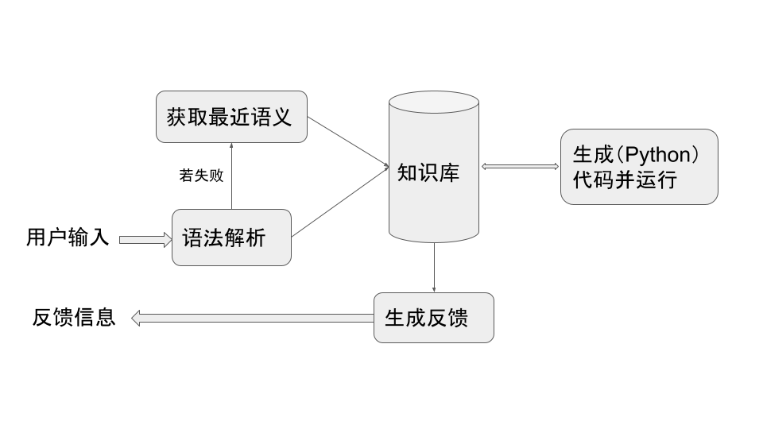

对 [前文](https://zhuanlan.zhihu.com/p/437867297) 末尾待做事项中 0.0.1 迭代必需的部分进行补充。

## 大致架构

对用户输入进行语法解析，若失败，则获取最近语义，将新信息加入知识库以及查询所需信息，如需要则生成（暂用Python）可运行代码、运行获得结果后再合入知识库，基于返回内容生成反馈信息。略图如下：



由于语法仍简单，输入解析后暂不形成语法树、直接纳入知识库条目。

## 知识库

### 根据输入语义操作知识库

- 发问未知值
  - 搜索该量的对应值，如该量不存在，新增值为空的知识条目并返回该条目
  - 如该量存在，则返回该知识条目
- 叙述已知值、未知反馈
  - 如该量不存在，新增并返回该条目
  - 如该量存在而且原值相同（包括空），则返回“无冲突”
  - 如该量存在但与原值有异，修改并返回该条目
- 叙述关系：与“叙述已知值”类似，但不存在关系为空的情况

关于在更新“摄氏度”值后自动更新“华氏度”值，前文评论区有些设计相关探讨。

> 假如用户再输入一个逆向关系“摄氏度是华氏度减32乘5除以9”的话，就需要检验两个算式是否矛盾以及避免更新量进入死循环等。在今后引入更多量的相互关系时，几乎是必然会遇到此类问题，可能还牵涉到小数计算不精确等。

> 暂时打算在0.0.1中不对逆向关系作特别处理，但在今后与之前验证错误断言比如“180摄氏度是300华氏度”等推导相关功能一同纳入考虑。

> 又回想了一下当初为何决定在得到“华氏度是摄氏度乘9除以5加32”后直接反馈华氏度值，应该是因为一开始华氏度是个未知值（知识条目中的值为空），用户因为“问过了”，应该不需要“再问一遍”就得到它的值。而对摄氏度作修改后在反馈中包含新的华氏度值，主要是为了用户体验的一致。

> 关于修改华氏度，暂时就随着摄氏度更新/覆盖吧（无逆向关系时）。如何自动获取华氏度到摄氏度的「逆向操作」是个大课题，希望有现成解决方案可用（至少对一些常见可反的函数种类）。没有的话就在需要时手工输入反函数。

暂用简单方式实现量的更新。当一个量更新时，更新所有依赖此量的量。量间关系相关结构见下一节。

### 相关数据结构

量值数据结构如下：
```json
{
  量: "华氏度",
  值: 空 或 数值
}
```
算式数据结构：以<运算符，数>对为元素的有序列表

如“乘9除以5加32”转换为：
```
[<乘，9>，<除，5>，<加，32>]
```

虽然功能相当局限，但此两例够用。生成中文反馈时只需遍历列表即可。

以下结构保存量之间的依赖关系，作为知识库的一部分：
```json
{
  量: 华氏度,
  依赖: 摄氏度,
  算式: [<乘，9>，<除，5>，<加，32>]
}
```

完成此两个用例之后，根据需要添加更多信息，比如条目添加的时间戳。

## 生成反馈

合并前文各部分算法简述如下：
- 如果叙述的已知值与知识条目相同，即无知识条目修改或新增，包括未知量也无变化，则输出“没错”
- 对所有新增的知识条目
  - 如果值非空，输出“{名称}是{值}”
  - 如果值为空，输出“不知{名称}是多少”
  - 如果是量之间关系，基于值中的算式生成对应中文，如“华氏度是摄氏度乘9除以5加32”
- 对修改了的知识条目，输出“{名称}是{值}”
- 对搜索返回的知识条目，按上面相同格式输出对应中文

各输出语句间用逗号分隔。

## 获取最近语义

算法描述与纸上演算见 [原答](https://www.zhihu.com/question/349028712/answer/2220729987)“获取最近语义”部分。

## 代码生成

暂生成Python代码运行。

### 新增、修改量值知识条目

对应代码：{量} = {值}，运行后不更新知识库

### 新增、修改量关系

对应代码：{量} = {依赖} {运算符1 数1} {运算符2 数2} ...

运行后，再运行：{量} 以获得其值

最后更新知识库该量的值。

## 手工演算

根据上述算法进行目标会话的逐步演算，列出关键数据结构内容。

### 摄氏度是180

解析为“叙述已知值”。知识库添加知识条目并返回：
```json
{量: "摄氏度", 值: 180}
```

生成python代码运行：`摄氏度 = 180`

反馈“摄氏度是180”。

当前所有知识：
```json
{量: "摄氏度", 值: 180}
```

### 华氏度是多少

解析为“发问未知值”。知识库中无为“华氏度”的条目，于是添加条目并返回：
```json
{量: "华氏度", 值: 空}
```
反馈“不知华氏度是多少”

当前所有知识：
```json
{量: "摄氏度", 值: 180}
{量: "华氏度", 值: 空}
```

### 摄氏度是180，不知华氏度是多少

解析为“叙述已知值”和“未知反馈”，知识库返回“无冲突”，内容不变。

反馈“没错”。

### 华氏度是摄氏度乘9除以5加32

解析为“叙述关系”。知识库新增条目并返回：
```json
{
  量: "华氏度",
  依赖: 摄氏度,
  算式: [<乘，9>，<除，5>，<加，32>]
}
```

反馈“华氏度是摄氏度乘9除以5加32”。

当前所有知识：
```json
{量: "摄氏度", 值: 180}
{量: "华氏度", 值: 空}

{
  量: "华氏度",
  依赖: 摄氏度,
  算式: [<乘，9>，<除，5>，<加，32>]
}
```

生成python代码：`华氏度 = 摄氏度 * 9 // 5 + 32`，运行后，再运行 `华氏度`，得到返回值为“356”，于是修改条目 `{量: "华氏度", 值: 空}`为：
```json
{量: "华氏度", 值: 356}
```
修改该条目后，在量关系中搜索“依赖”为“华氏度”的条目，不存在因而无需更新其他量。

再加反馈“华氏度是356”。

当前所有知识：
```json
{量: "摄氏度", 值: 180}
{量: "华氏度", 值: 356}

{
  量: "华氏度",
  依赖: 摄氏度,
  算式: [<乘，9>，<除，5>，<加，32>]
}
```

### 摄氏度是180，华氏度是356

解析为两个“叙述已知值”。知识库返回“无冲突”

反馈“没错”。

### 摄氏度200

获取最近语义为“叙述已知值”，修改知识库条目：
```json
{量: "摄氏度", 值: 200}
```

当前所有知识：
```json
{量: "摄氏度", 值: 200}
{量: "华氏度", 值: 356}

{
  量: "华氏度",
  依赖: 摄氏度,
  算式: [<乘，9>，<除，5>，<加，32>]
}
```

修改了条目后，寻找依赖为“摄氏度”的量，运行对应Python代码、取值后对原条目 `{量: "华氏度", 值: 356}` 修改为：
```json
{量: "华氏度", 值: 392}
```

反馈所有修改的条目“摄氏度是200，华氏度是392”。

当前所有知识：
```json
{量: "摄氏度", 值: 200}
{量: "华氏度", 值: 392}

{
  量: "华氏度",
  依赖: 摄氏度,
  算式: [<乘，9>，<除，5>，<加，32>]
}
```

### 华氏度

获取最近语义为“发问未知值”，知识库中搜到量为“华氏度”的条目并返回。

反馈“华氏度是392”。

## 小结

基本确定 0.0.1 迭代目标达成。倘有疏漏不足请不吝指教。
